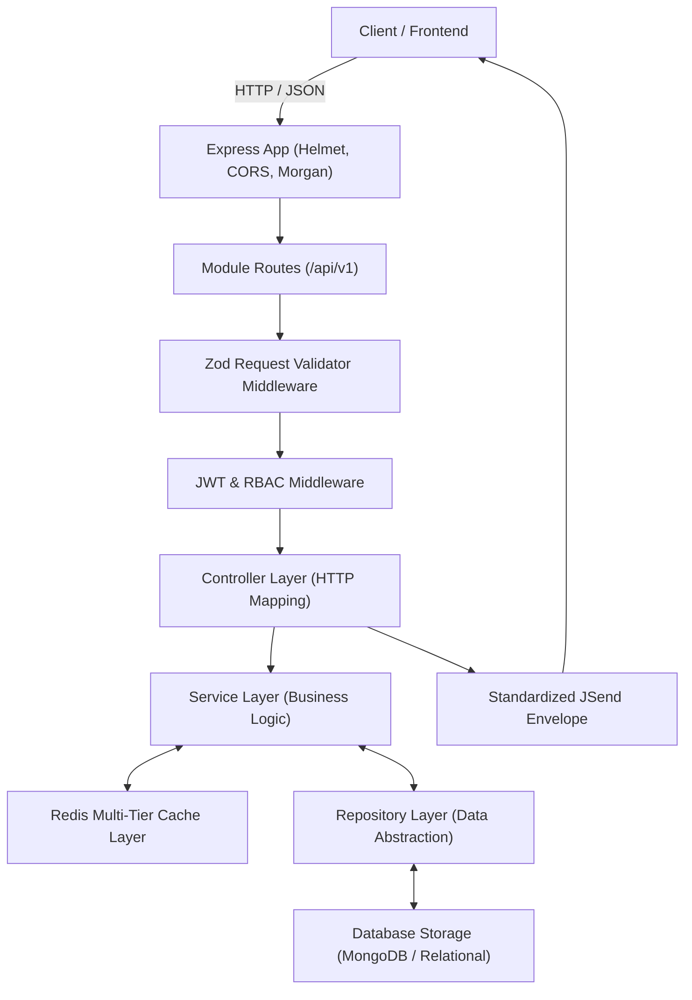

# Node.js TypeScript Modular REST API Starter

[](https://github.com/pkgtm2419/node-ts-modular-api-starter/actions)
[](LICENSE)
[](https://www.typescriptlang.org/)
[](https://nodejs.org/)

Production-grade, highly maintainable REST API starter engineered with **Node.js**, **Express.js**, and strict **TypeScript**. Implements clean **Controller-Service-Repository** modular layering, JWT & Role-Based Access Control (RBAC), multi-tier Redis caching, Zod request validation, OpenAPI/Swagger 3.0 documentation, and automated Jest test suites with GitHub Actions CI.

---

## 🏛️ System Architecture



---

## 🚀 Key Features

* **Strict TypeScript (ESM):** Full type safety, strict null checks, and modern ES2022 module resolution.
* **Modular Domain Structure:** Scalable directory organization by feature module (`auth`, `users`, `health`) containing its own routes, controller, service, repository, and schemas.
* **Security Hardened:** Powered by `helmet`, strict `cors` policies, secure HTTP-only cookies support, and bcrypt password hashing.
* **JWT & RBAC Engine:** Token verification, payload injection, and declarative role hierarchy guards (`admin`, `moderator`, `user`).
* **Multi-Tiered Caching:** Fast caching layer with automatic fallback to high-speed in-memory store for local environments.
* **Schema Validation:** Strict runtime validation powered by `zod` with automated formatting of 400 Bad Request error envelopes.
* **Interactive API Docs:** Built-in Swagger UI compliant with OpenAPI 3.0 specs available at `/api/docs`.
* **Automated CI/CD:** GitHub Actions test matrix across Node.js 18.x, 20.x, and 22.x with code coverage tracking.

---

## 📁 Directory Structure

```text
node-ts-modular-api-starter/
├── .github/
│   └── workflows/
│       └── ci.yml               # Automated CI pipeline
├── src/
│   ├── config/                  # Environment, Redis, and Swagger specs
│   ├── middlewares/             # JWT auth, RBAC, error handlers, and Zod validation
│   ├── modules/
│   │   ├── auth/                # Register, login, token refresh
│   │   ├── health/              # Uptime and process health probes
│   │   └── users/               # Profile, user management, and repository logic
│   ├── utils/                   # Standard API response envelopes & logger
│   ├── app.ts                   # Express application bootstrap
│   └── server.ts                # Server entrypoint with graceful shutdown
├── tests/                       # Unit and integration test suites (Supertest + Jest)
├── .env.example
├── package.json
├── tsconfig.json
└── README.md
```

---

## ⚡ Quick Start

### 1. Prerequisites
* Node.js v18.0.0 or higher
* npm v9.0.0 or higher
* Optional: Redis instance (falls back to memory cache automatically)

### 2. Installation
```bash
git clone https://github.com/pkgtm2419/node-ts-modular-api-starter.git
cd node-ts-modular-api-starter
npm install
```

### 3. Environment Setup
```bash
cp .env.example .env
```

### 4. Running the Application
```bash
# Development mode with hot reloading
npm run dev

# Compile TypeScript
npm run build

# Production start
npm start
```

API will be running on `http://localhost:5000` with Swagger documentation at `http://localhost:5000/api/docs`.

---

## 🧪 Testing

```bash
# Run all tests
npm test

# Run tests with coverage report
npm run test:coverage
```

---

## 📜 License
MIT License. Free to use, adapt, and distribute for personal and commercial projects. Created by [Pawan Kumar Gautam](https://github.com/pkgtm2419).
