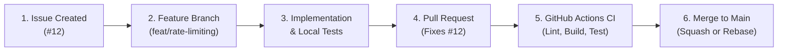

# Engineering Development & Contribution Workflow

This document details the exact git and engineering lifecycle for delivering high-quality changes to `node-ts-modular-api-starter`.

---

## 1. Issue-to-Deployment Pipeline Overview



---

## 2. Step-by-Step Delivery Stages

### Step 1: Issue Tracking
Every non-trivial modification begins with a GitHub Issue using our structured templates (`.github/ISSUE_TEMPLATE/`):
- Assign clear acceptance criteria, priorities, and relevant labels (`bug`, `enhancement`, `documentation`, `security`).
- Discussion and architectural decisions are recorded on the issue thread before coding starts.

### Step 2: Branch Creation
Create a descriptive branch off `main`:
```bash
git checkout main
git pull origin main
git checkout -b feat/custom-rate-limiter
```
**Branch Naming Format:**
- `feat/<short-description>`: New feature or capability.
- `fix/<short-description>`: Defect resolution.
- `docs/<short-description>`: Documentation and guides.
- `refactor/<short-description>`: Code restructuring without functional changes.
- `test/<short-description>`: Expanding test suites and coverage.

### Step 3: Local Development & Verification
Before pushing commits, verify the three quality gates locally:
```bash
# 1. Static Type Checking & Linting
npm run lint

# 2. TypeScript Compilation
npm run build

# 3. Automated Test Execution
npm test
```

### Step 4: Commit Message Standards
Commits must adhere to [Conventional Commits v1.0.0](https://www.conventionalcommits.org/):
```text
feat(auth): implement redis token blacklist revocation

- Add Redis client token invalidation on user logout
- Inject checkBlacklist middleware to protected user routes
- Add integration tests verifying revoked tokens return 401

Fixes #14
```

### Step 5: Pull Request Submission
1. Push branch to GitHub:
   ```bash
   git push -u origin feat/custom-rate-limiter
   ```
2. Open a Pull Request using the repository template (`.github/pull_request_template.md`).
3. Link the target issue using closing keywords: `Fixes #14` or `Closes #14`.

### Step 6: Automated CI Verification & Merging
- GitHub Actions automatically executes the matrix build on Node.js 18.x, 20.x, and 22.x.
- All checks must be green before merging.
- Merge using **Squash and Merge** or **Rebase and Merge** to maintain a linear, bisectable git history.
